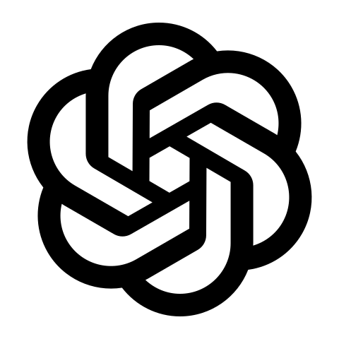

<!-- Header animation -->

# Hi, I'm Felipe Cezar 👋
### Software Engineer & Data Analyst

---

## 👨‍💻 About Me

- 🎓 Postgraduate student focused on **Data Analysis & Software Engineering**
- 💻 Passionate about building scalable backend systems and extracting insights from data
- 🌱 Currently diving deeper into **data science, machine learning, and cloud architecture**
- 🤝 Open to collaborations on interesting projects

---

## 🤝 Connect With Me

<table>
  <tr>
    <td align="center">
      
       LinkedIn
    </td>
    <td align="center">
      
       Dev.to
    </td>
  </tr>
</table>

---

## 🛠️ Tech Stack

<h3 align="center">Web Development</h3>

<table style="background-color: black; color: white; border: none; border-radius: 15px; overflow: hidden;">
  <thead>
    <tr>
      <th colspan="5" align="center" style="color: white;">Frontend</th>
    </tr>
  </thead>
  <tbody>
    <tr>
      <td align="center">
        
         React
      </td>
      <td align="center">
        
         TypeScript
      </td>
      <td align="center">
        
         JavaScript
      </td>
      <td align="center">
        
         HTML
      </td>
      <td align="center">
        
         CSS
      </td>
    </tr>
  </tbody>
</table>

<table style="background-color: black; color: white; border: none; border-radius: 15px; overflow: hidden;">
  <thead>
    <tr>
      <th colspan="5" align="center" style="color: white;">Backend</th>
    </tr>
  </thead>
  <tbody>
    <tr>
      <td align="center">
         Node.js
      </td>
      <td align="center">
         Django
      </td>
      <td align="center">
         Flask
      </td>
      <td align="center">
         Express
      </td>
      <td align="center">
         Spring
      </td>
    </tr>
  </tbody>
</table>

<h3 align="center">Data & Databases</h3>

<table style="background-color: black; color: white; border: none; border-radius: 15px; overflow: hidden;">
  <thead>
    <tr>
      <th colspan="6" align="center" style="color: white;">Data Analysis & Databases</th>
    </tr>
  </thead>
  <tbody>
    <tr>
      <td align="center">
         MySQL
      </td>
      <td align="center">
         MongoDB
      </td>
      <td align="center">
         PostgreSQL
      </td>
      <td align="center">
         Python
      </td>
      <td align="center">
         Pandas
      </td>
      <td align="center">
         R
      </td>
    </tr>
  </tbody>
</table>

<h3 align="center">Cloud Computing & DevOps</h3>

<table style="background-color: black; color: white; border: none; border-radius: 15px; overflow: hidden;">
  <thead>
    <tr>
      <th colspan="3" align="center" style="color: white;">Cloud & Containers</th>
    </tr>
  </thead>
  <tbody>
    <tr>
      <td align="center">
         Docker
      </td>
      <td align="center">
         Kubernetes
      </td>
      <td align="center">
         AWS
      </td>
    </tr>
  </tbody>
</table>

---

## 📊 GitHub Statistics

  
  

---

## 🤖 AI Co-workers

<table>
  <tr>
    <td align="center" width="160">
       
      
        <b>Claude</b>
       
    </td>
    <td align="center" width="160">
       
      
        <b>ChatGPT</b>
       
    </td>
    <td align="center" width="160">
       
      
        <b>Gemini</b>
       
    </td>
  </tr>
</table>

---

## 📈 Contribution Graph

---

## 🌐 3D Contribution Calendar

  

---

## 🐍 Contribution Snake

<picture>
  <source media="(prefers-color-scheme: dark)" srcset="https://raw.githubusercontent.com/felipecezar01/felipecezar01/output/github-contribution-grid-snake-dark.svg">
  <source media="(prefers-color-scheme: light)" srcset="https://raw.githubusercontent.com/felipecezar01/felipecezar01/output/github-contribution-grid-snake.svg">
  
</picture>

---

## 📍 Profile Visitors

  

---

<!-- Footer animation -->

